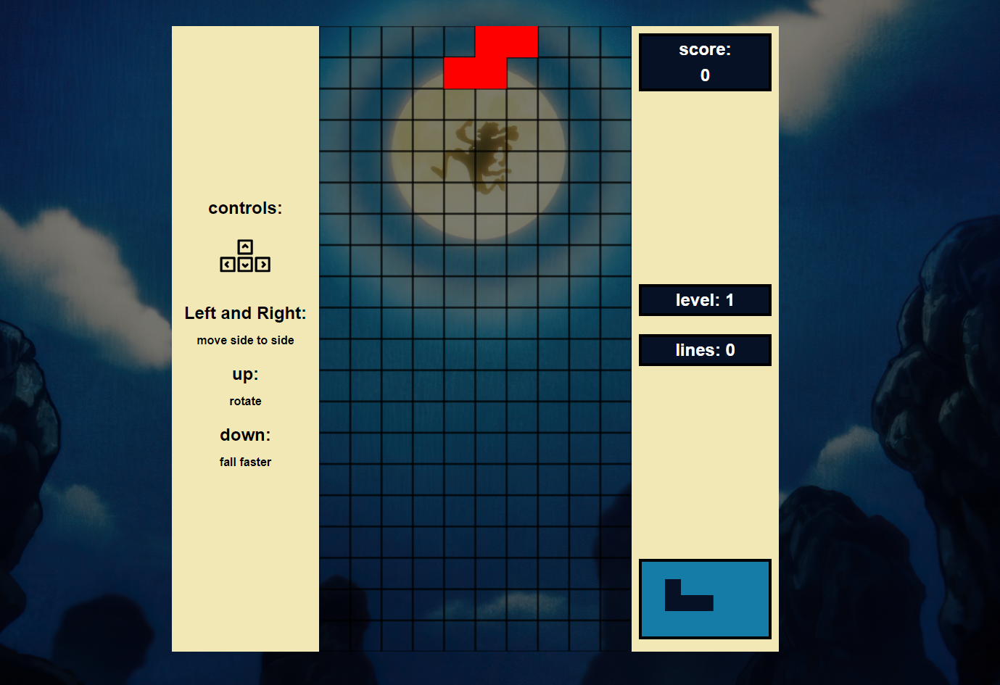

¡Claro! Aquí tienes el README actualizado:

---

# 🎮 Tetris Game

Bienvenido a mi proyecto de Tetris! Este es un clásico juego de Tetris implementado con HTML5, CSS3 y JavaScript. 🧩

## 🚀 Características

- **Interfaz Clásica**: Un diseño que evoca la nostalgia del Tetris original.
- **Controles Intuitivos**: Usa las flechas del teclado para mover y rotar las piezas.
- **Próxima Pieza**: Muestra cuál será la siguiente pieza para planificar mejor tus movimientos.
- **Puntuación**: Lleva un registro de tu puntaje y desafía tus mejores marcas.
- **Efectos Visuales**: Un degradado sutil y efectos visuales que hacen el juego más agradable a la vista.
- **Escalabilidad de Piezas**: La próxima pieza se muestra en una escala mayor para una mejor visibilidad.

## 📸 Capturas de Pantalla



## 📜 Instrucciones de Instalación

1. Clona el repositorio:
   ```bash
   git clone https://github.com/abernix102/tetris-game.git
   ```

2. Navega al directorio del proyecto:
   ```bash
   cd tetris-game
   ```

3. Abre `index.html` en tu navegador preferido.

## 🎯 Objetivos del Proyecto

- Aprender y practicar HTML5 Canvas.
- Mejorar habilidades en JavaScript y manejo del DOM.
- Implementar mecánicas de juego clásicas de Tetris.
- Crear una interfaz de usuario atractiva con CSS.

## 🕹️ Controles del Juego

- **Flecha Izquierda**: Mover pieza a la izquierda.
- **Flecha Derecha**: Mover pieza a la derecha.
- **Flecha Arriba**: Rotar pieza.
- **Flecha Abajo**: Acelerar caída de la pieza.

## 💻 Tecnologías Utilizadas

- HTML5
- CSS3
- JavaScript

## 🔨 Estado del Proyecto

🚧 **En Desarrollo**: Este proyecto aún está en progreso. Hay características y mejoras adicionales que planeo implementar. ¡Mantente atento a las actualizaciones!

## ✨ Contribuciones

¡Las contribuciones son bienvenidas! Si deseas mejorar este proyecto, por favor abre un issue o envía un pull request.


---

¡Gracias por visitar mi proyecto de Tetris! Espero que disfrutes jugando tanto como yo disfruté desarrollándolo. 🎉

---

Si necesitas ajustar algún detalle o agregar algo más específico, por favor avísame.